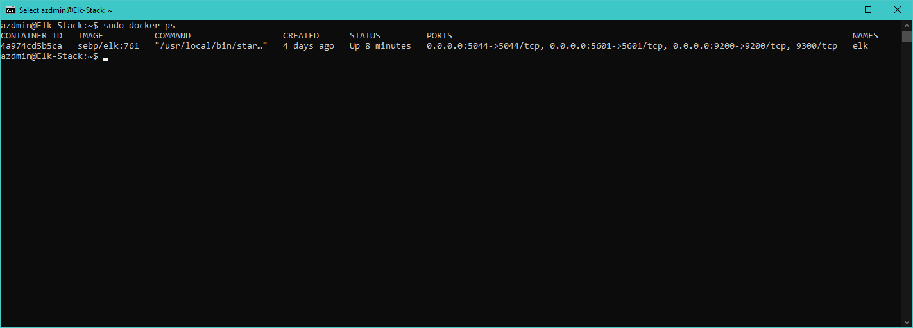

# Cyber-Security-Class-Files
## Automated ELK Stack Deployment

The files in this repository were used to configure the network depicted below.

These files have been tested and used to generate a live ELK deployment on Azure. They can be used to either recreate the entire deployment pictured above. Alternatively, select portions of the ansible playbook file may be used to install only certain pieces of it, such as Filebeat.

  - _Install-Elk: [https://github.com/martinjs209/Cyber-Security-Class-Files/Ansible/Install-elk.yml](/Ansible/Install-elk.yml)_

  - _Hosts: [https://github.com/martinjs209/Cyber-Security-Class-Files/Ansible/hosts](Ansible/hosts)_

  - _Ansible Configuration: [https://github.com/martinjs209/Cyber-Security-Class-Files/Ansible/ansible.config](Ansible/ansible.config)_

This document contains the following details:
- Description of the Topologu
- Access Policies
- ELK Configuration
  - Beats in Use
  - Machines Being Monitored
- How to Use the Ansible Build

### Description of the Topology

The main purpose of this network is to expose a load-balanced and monitored instance of DVWA, the D*mn Vulnerable Web Application.

Load balancing ensures that the application will be highly available, in addition to restricting access to the network.
- _Load balancers help mitagate against DDoS attacks and such other attacks. The advantage of having a jump box is to inspect incoming traffic and to prevent unwanted access._

Integrating an ELK server allows users to easily monitor the vulnerable VMs for changes to the data and system logs.
- _The purpose of Filebeat is to collect log files and to push it to Elasticsearch or Logstash._
- _The purpose of Metricbeat is to records stats and to push that information to Elasticsearch or Logstash_

The configuration details of each machine may be found below.
_Note: Use the [Markdown Table Generator](http://www.tablesgenerator.com/markdown_tables) to add/remove values from the table._

| Name      | Function   | IP Address | Operation System |
|-----------|------------|------------|------------------|
| Jump-Box  | Gateway    | 10.1.0.4   | Linux            |
| Web-1     | Server     | 10.1.0.5   | Linux            |
| Web-2     | Server     | 10.1.0.6   | Linux            |
| Elk-Stack | Log Server | 10.0.0.4   | Linux            |

### Access Policies

The machines on the internal network are not exposed to the public Internet. 

Only the Jump-Box machine can accept connections from the Internet. Access to this machine is only allowed from the following IP addresses:
- _Personal Public IP Address_

Machines within the network can only be accessed by Jump-Box.
- _The Jump-Box machine can connect by SSH to Elk-Stack machine by using Port 22. Also another connection can be made through Port 5601 by using a Personal IP Address._

A summary of the access policies in place can be found in the table below.

| Name          | Publicly Accessible | Allowed IP Address |
|---------------|---------------------|--------------------|
| Jump-Box      | Yes                 | Personal IP        |
| Web-1         | No                  | 10.1.0.5           |
| Web-2         | No                  | 10.1.0.6           |
| Elk-Stack     | Yes                 | Personal IP        |
| Load-Balancer | Yes                 | Open               |

### Elk Configuration

Ansible was used to automate configuration of the ELK machine. No configuration was performed manually, which is advantageous because...
- _Ansible is very simple and quick to use. The interface is very easy to ready._

The playbook implements the following tasks:
- _TODO: In 3-5 bullets, explain the steps of the ELK installation play. E.g., install Docker; download image; etc._
- Sets maximum map count
- Install docker.io
- Install pip3
- Install Docker Module
- Download and launch Elk

The following screenshot displays the result of running `docker ps` after successfully configuring the ELK instance.

### Target Machines & Beats
This ELK server is configured to monitor the following machines:
- _Web-1 10.1.0.5_
- _Web-2 10.1.0.6_

We have installed the following Beats on these machines:
- _Filebeat and Metricbeat_

These Beats allow us to collect the following information from each machine:
- _Filebeat is collecting and monitoring logs on the machine and then pushes this information to Elasticsearch. File would be used as a method to verify logs and would then push these logs to Elk-Stack machine._

- _Metricbeat gathers stats from the machines and pushes that data to Elasticsearch. Metricbeat analysis the system logs and can give you basic information like running time of a system._

### Using the Playbook
In order to use the playbook, you will need to have an Ansible control node already configured. Assuming you have such a control node provisioned: 

SSH into the control node and follow the steps below:
- Copy the filebeat-config.yml file to /etc/ansible/files.
- Update the /etc/ansible/hosts file to include the IP Address' of the webservers and Elk-Stack.
- Run the playbook, and navigate to http://52.180.67.88:5601/app/kibana to check that the installation worked as expected.

_As a **Bonus**, provide the specific commands the user will need to run to download the playbook, update the files, etc._
